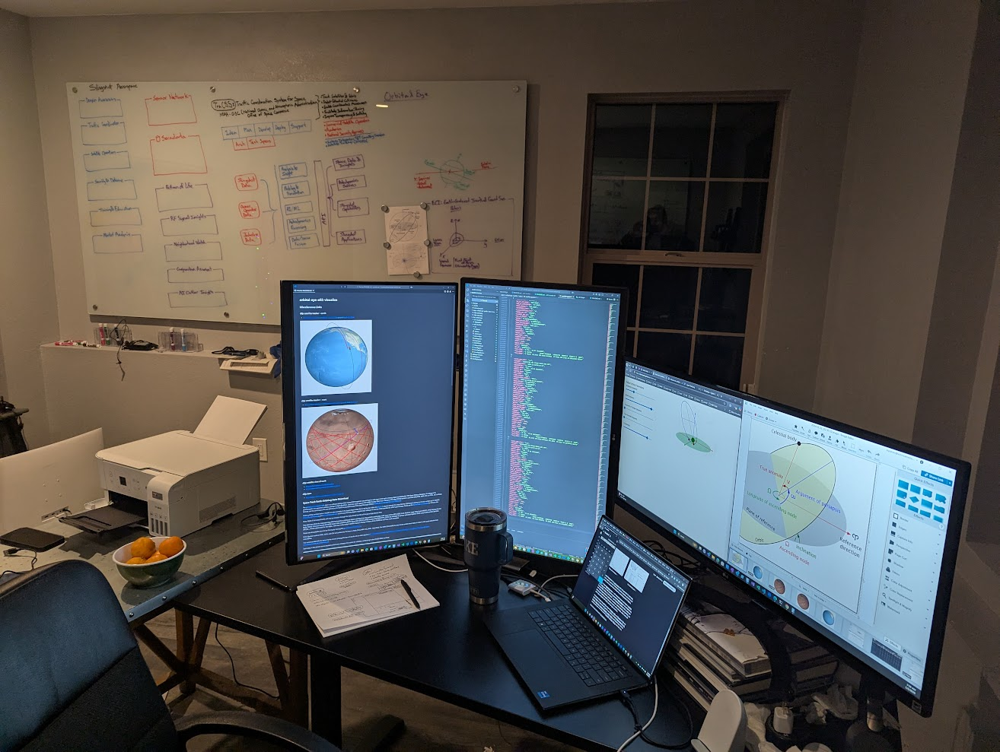
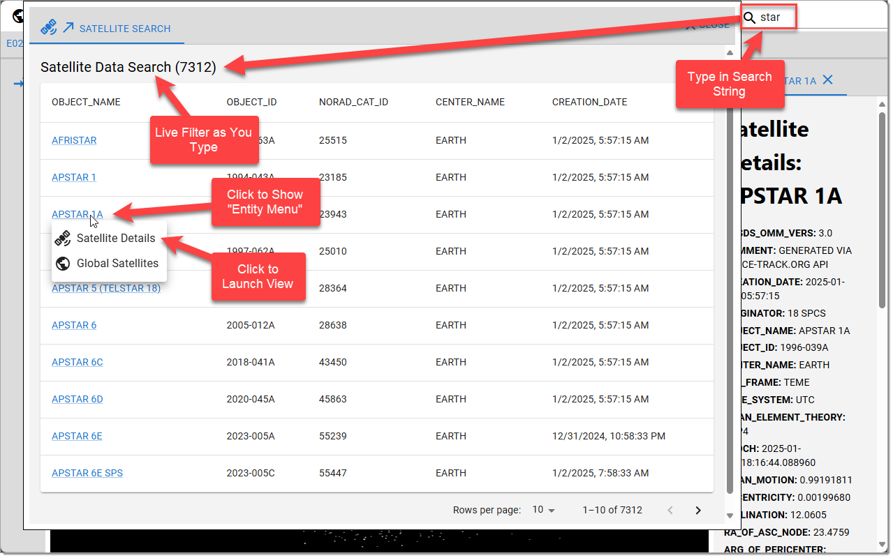
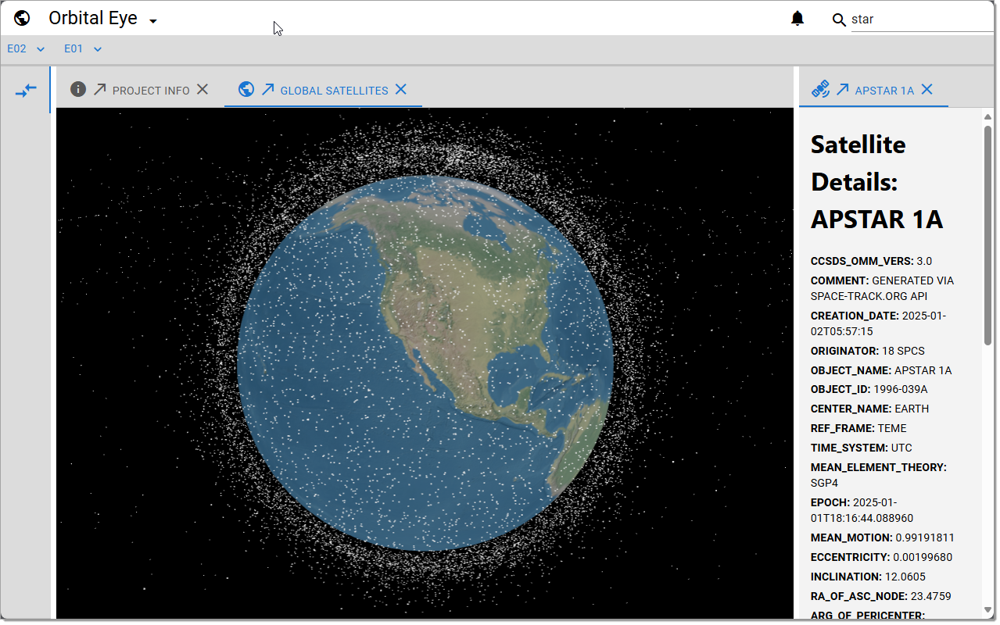
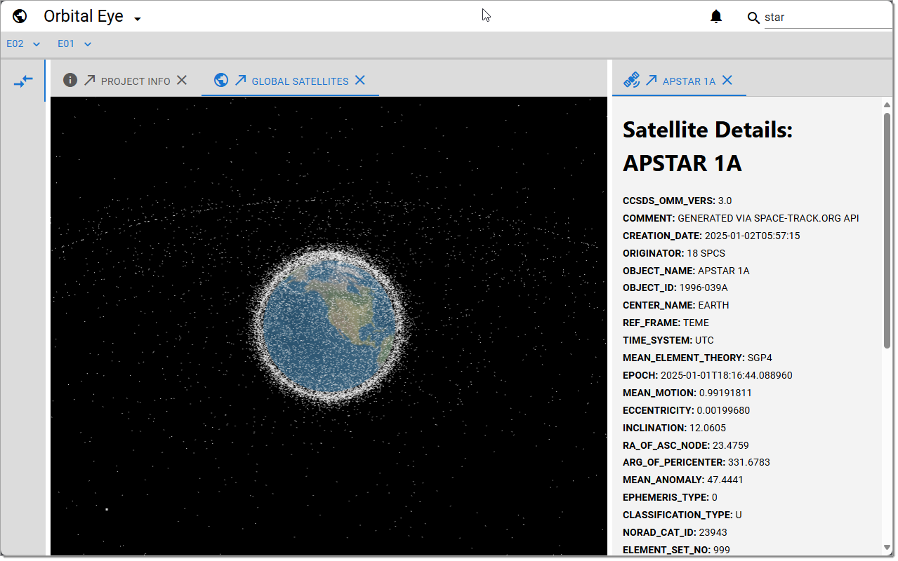

# OrbitalEye

A playground for orbital visualizations, calculations, and experiments

- [OrbitalEye](#orbitaleye)
  - [Building Orbital Eye](#building-orbital-eye)
  - [Running Orbital Eye Samples](#running-orbital-eye-samples)
- [Orbital Eye Recipe](#orbital-eye-recipe)
  - [Create GitHub Repo](#create-github-repo)
  - [Install NodeJS LTS](#install-nodejs-lts)
  - [Create Nx Workspace](#create-nx-workspace)
  - [Install nx globally](#install-nx-globally)
  - [Run it](#run-it)
  - [Add remote](#add-remote)
  - [@orbital-eye/e01-visualize Docs](#orbital-eyee01-visualize-docs)
  - [@orbital-eye/e02-visualize Docs](#orbital-eyee02-visualize-docs)
- [Publish orbital-eye App to GitHub Pages](#publish-orbital-eye-app-to-github-pages)
  - [**1. Prerequisites**](#1-prerequisites)
  - [**2. Install `gh-pages` Package**](#2-install-gh-pages-package)
  - [**3. Update Next.js App for Static Export**](#3-update-nextjs-app-for-static-export)
  - [**4. Add a Deploy Script to `package.json`**](#4-add-a-deploy-script-to-packagejson)
  - [**5. Set Up GitHub Repository**](#5-set-up-github-repository)
    - [Create Empty gh-pages branch](#create-empty-gh-pages-branch)
  - [**6. Build and Deploy to GitHub Pages**](#6-build-and-deploy-to-github-pages)
  - [**7. Verify Deployment**](#7-verify-deployment)
  - [**10. (TODO) Automate Deployment**](#10-todo-automate-deployment)
- [Nx Stuff](#nx-stuff)
  - [Integrate with editors](#integrate-with-editors)
  - [Start the application](#start-the-application)
  - [Build for production](#build-for-production)
  - [Running tasks](#running-tasks)
  - [Set up CI!](#set-up-ci)
  - [Explore the project graph](#explore-the-project-graph)
  - [Connect with us!](#connect-with-us)

* [@portal-eye/e01-visualize](./libs/orbital-eye/e01-visualize/README.md) Sample
* [@portal-eye/e02-visualize](./libs/orbital-eye/e02-visualize/README.md) Sample

## Building Orbital Eye



## Running Orbital Eye Samples

Try it out !!
[https://datumgeek.github.io/orbital-eye/e02](https://datumgeek.github.io/orbital-eye/e02)

Investigate the [Implementation](./libs/orbital-eye/e02-visualize/README.md)







---

Try it out !!
[https://datumgeek.github.io/orbital-eye/](https://datumgeek.github.io/orbital-eye/)

Investigate the [Implementation](./libs/orbital-eye/e01-visualize/README.md)


---

Try it out in [Porrtal](https://github.com/comcast/porrtal) Open-Source IDE-Like UX
[https://datumgeek.github.io/orbital-eye/portal/](https://datumgeek.github.io/orbital-eye/portal/)

Investigate the [Implementation](./libs/orbital-eye/e01-visualize/README.md#add-porrtal-open-source-ide-like-ux)


---


# Orbital Eye Recipe

## Create GitHub Repo
    
- https://github.com/datumgeek/orbital-eye.git
- [Readme](https://github.com/datumgeek/orbital-eye?tab=readme-ov-file#orbitaleye)
    
## Install NodeJS LTS
    
- [https://nodejs.org](https://nodejs.org)
    
## Create Nx Workspace
    
    npx create-nx-workspace
    
## Install nx globally

    npm install -g nx

## Run it
    
    cd orbital-eye
    nx dev orbital-eye
- http://localhost:3000
    
## Add remote
    
    git remote add origin https://github.com/datumgeek/orbital-eye.git

## @orbital-eye/e01-visualize Docs

Investigate the [Implementation](./libs/orbital-eye/e01-visualize/README.md)

## @orbital-eye/e02-visualize Docs

Investigate the [Implementation](./libs/orbital-eye/e02-visualize/README.md)

# Publish orbital-eye App to GitHub Pages

Publishing the orbital-eye Next.js app from an NX monorepo to GitHub Pages involves additional considerations because Next.js apps are dynamic by nature, but they can be exported as static websites using the `next export` command. Below is step-by-step guide:

---

## **1. Prerequisites**
- Ensure your app is fully static (no server-side processing or services).
- You have a GitHub repository set up for your project.

---

## **2. Install `gh-pages` Package**
Install the `gh-pages` package to simplify deployment to GitHub Pages:

```bash
npm install --save-dev gh-pages
```

---

## **3. Update Next.js App for Static Export**
1. Open the `next.config.js` file in your Next.js app directory (`apps/orbital-eye`).
2. Add the `trailingSlash`, `basePath`, `assetPrefix` and `output` properties to the configuration.
3. After you publish, comment out the `basePath`, `assetPrefix` and `output` properties for `nx dev orbital-eye` local development

```javascript
//@ts-check

// eslint-disable-next-line @typescript-eslint/no-var-requires
const { composePlugins, withNx } = require('@nx/next');

/**
 * @type {import('@nx/next/plugins/with-nx').WithNxOptions}
 **/
const nextConfig = {
  nx: {
    // Set this to true if you would like to use SVGR
    // See: https://github.com/gregberge/svgr
    svgr: false,
  },
  trailingSlash: true,
  // uncomment these for gh-pages deployment
  basePath: '/orbital-eye',
  assetPrefix: '/orbital-eye',
  output: 'export'
};

const plugins = [
  // Add more Next.js plugins to this list if needed.
  withNx,
];

module.exports = composePlugins(...plugins)(nextConfig);
```

This ensures the app can be statically exported and hosted under the `/orbital-eye` route of your GitHub Pages site.

---

## **4. Add a Deploy Script to `package.json`**
Add a `deploy` script to the root `package.json`:

```json
"scripts": {
  "deploy": "nx build orbital-eye && gh-pages -d dist/apps/orbital-eye"
}
```

---

## **5. Set Up GitHub Repository**

### Create Empty gh-pages branch

```bash
git checkout --orphan gh-pages
git reset --hard
git commit --allow-empty -m "fresh and empty gh-pages branch"
git push origin gh-pages
git checkout main
```

1. Go to your GitHub repository.
2. Navigate to **Settings > Pages**.
3. Under **Source**, select `gh-pages` branch.
4. Save the changes.

---

## **6. Build and Deploy to GitHub Pages**
Run the deploy script:

```bash
npm run deploy
```

This pushes the exported static files to the `gh-pages` branch in your GitHub repository.

---

## **7. Verify Deployment**
- Go to `https://datumgeek.github.io/orbital-eye/` to view your deployed site.
- Check that all routes and assets load correctly.

---

## **10. (TODO) Automate Deployment**
Automate this process using GitHub Actions:
1. Create a new workflow file at `.github/workflows/deploy.yml`.
2. Use a workflow that builds, exports, and deploys your Next.js app to GitHub Pages.

# Nx Stuff

<a alt="Nx logo" href="https://nx.dev" target="_blank" rel="noreferrer"></a>

✨ **This workspace has been generated by [Nx, Smart Monorepos · Fast CI.](https://nx.dev)** ✨

## Integrate with editors

Enhance your Nx experience by installing [Nx Console](https://nx.dev/nx-console) for your favorite editor. Nx Console
provides an interactive UI to view your projects, run tasks, generate code, and more! Available for VSCode, IntelliJ and
comes with a LSP for Vim users.

## Start the application

Run `npx nx dev orbital-eye` to start the development server. Happy coding!

## Build for production

Run `npx nx build orbital-eye` to build the application. The build artifacts are stored in the output directory (e.g. `dist/` or `build/`), ready to be deployed.

## Running tasks

To execute tasks with Nx use the following syntax:

```
npx nx <target> <project> <...options>
```

You can also run multiple targets:

```
npx nx run-many -t <target1> <target2>
```

..or add `-p` to filter specific projects

```
npx nx run-many -t <target1> <target2> -p <proj1> <proj2>
```

Targets can be defined in the `package.json` or `projects.json`. Learn more [in the docs](https://nx.dev/features/run-tasks).

## Set up CI!

Nx comes with local caching already built-in (check your `nx.json`). On CI you might want to go a step further.

- [Set up remote caching](https://nx.dev/features/share-your-cache)
- [Set up task distribution across multiple machines](https://nx.dev/nx-cloud/features/distribute-task-execution)
- [Learn more how to setup CI](https://nx.dev/recipes/ci)

## Explore the project graph

Run `npx nx graph` to show the graph of the workspace.
It will show tasks that you can run with Nx.

- [Learn more about Exploring the Project Graph](https://nx.dev/core-features/explore-graph)

## Connect with us!

- [Join the community](https://nx.dev/community)
- [Subscribe to the Nx Youtube Channel](https://www.youtube.com/@nxdevtools)
- [Follow us on Twitter](https://twitter.com/nxdevtools)
