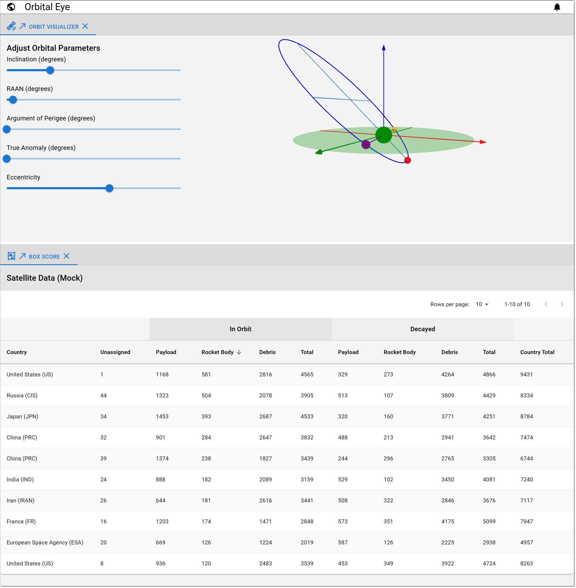

# OrbitalEye

A playground for orbital visualizations, calculations, and experiments

Try it out !!
[https://datumgeek.github.io/orbital-eye/](https://datumgeek.github.io/orbital-eye/)

Investigate the [Implementation](./libs/orbital-eye/e01-visualize/README.md)


---

Try it out in [Porrtal](https://github.com/comcast/porrtal) Open-Source IDE-Like UX
[https://datumgeek.github.io/orbital-eye/portal/](https://datumgeek.github.io/orbital-eye/portal/)

Investigate the [Implementation](./libs/orbital-eye/e01-visualize/README.md#add-porrtal-open-source-ide-like-ux)



---


# Orbital Eye Recipe

## Create GitHub Repo
    
- https://github.com/datumgeek/orbital-eye.git
- [Readme](https://github.com/datumgeek/orbital-eye?tab=readme-ov-file#orbitaleye)
    
## Install NodeJS LTS
    
- [https://nodejs.org](https://nodejs.org)
    
## Create Nx Workspace
    
    npx create-nx-workspace
    
## Install nx globally

    npm install -g nx

## Run it
    
    cd orbital-eye
    nx dev orbital-eye
- http://localhost:3000
    
## Add remote
    
    git remote add origin https://github.com/datumgeek/orbital-eye.git


# Nx Stuff

<a alt="Nx logo" href="https://nx.dev" target="_blank" rel="noreferrer"></a>

✨ **This workspace has been generated by [Nx, Smart Monorepos · Fast CI.](https://nx.dev)** ✨

## Integrate with editors

Enhance your Nx experience by installing [Nx Console](https://nx.dev/nx-console) for your favorite editor. Nx Console
provides an interactive UI to view your projects, run tasks, generate code, and more! Available for VSCode, IntelliJ and
comes with a LSP for Vim users.

## Start the application

Run `npx nx dev orbital-eye` to start the development server. Happy coding!

## Build for production

Run `npx nx build orbital-eye` to build the application. The build artifacts are stored in the output directory (e.g. `dist/` or `build/`), ready to be deployed.

## Running tasks

To execute tasks with Nx use the following syntax:

```
npx nx <target> <project> <...options>
```

You can also run multiple targets:

```
npx nx run-many -t <target1> <target2>
```

..or add `-p` to filter specific projects

```
npx nx run-many -t <target1> <target2> -p <proj1> <proj2>
```

Targets can be defined in the `package.json` or `projects.json`. Learn more [in the docs](https://nx.dev/features/run-tasks).

## Set up CI!

Nx comes with local caching already built-in (check your `nx.json`). On CI you might want to go a step further.

- [Set up remote caching](https://nx.dev/features/share-your-cache)
- [Set up task distribution across multiple machines](https://nx.dev/nx-cloud/features/distribute-task-execution)
- [Learn more how to setup CI](https://nx.dev/recipes/ci)

## Explore the project graph

Run `npx nx graph` to show the graph of the workspace.
It will show tasks that you can run with Nx.

- [Learn more about Exploring the Project Graph](https://nx.dev/core-features/explore-graph)

## Connect with us!

- [Join the community](https://nx.dev/community)
- [Subscribe to the Nx Youtube Channel](https://www.youtube.com/@nxdevtools)
- [Follow us on Twitter](https://twitter.com/nxdevtools)
