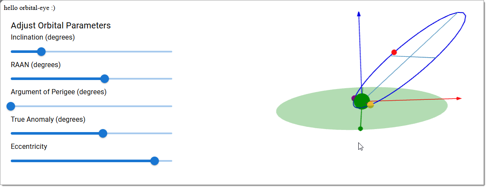
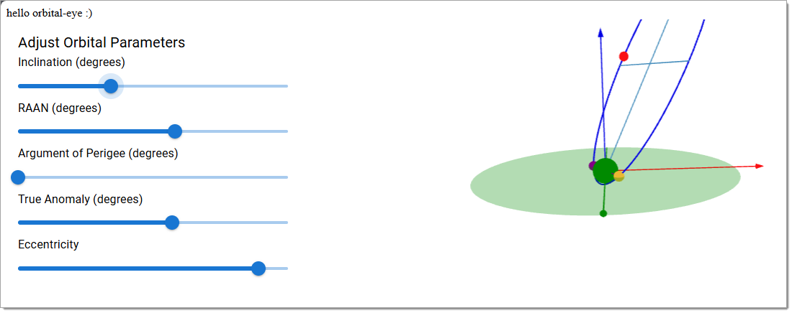

# @orbital-eye/e01-visualize Sample

Try it out !!
[https://datumgeek.github.io/orbital-eye/](https://datumgeek.github.io/orbital-eye/)


---

Try it out in [Porrtal](https://github.com/comcast/porrtal) Open-Source IDE-Like UX
[https://datumgeek.github.io/orbital-eye/portal/](https://datumgeek.github.io/orbital-eye/portal/)


---

- [@orbital-eye/e01-visualize Sample](#orbital-eyee01-visualize-sample)
- [Recipe](#recipe)
  - [Add Library `@orbital-eye/e01-visualize`](#add-library-orbital-eyee01-visualize)
  - [Add Component](#add-component)
  - [Add ThreeJS Visualization](#add-threejs-visualization)
  - [Boom shaka-laka !! :)](#boom-shaka-laka--)
  - [Getting Good !! :)](#getting-good--)
    - [Orbital Parameters Definitions](#orbital-parameters-definitions)
    - [Increase Eccentricity](#increase-eccentricity)
    - [Increase Inclination](#increase-inclination)
    - [Increase Argument of Perigee](#increase-argument-of-perigee)
  - [Add Porrtal (Open-Source IDE-Like UX)](#add-porrtal-open-source-ide-like-ux)
    - [Create NextJS Page ('/portal')](#create-nextjs-page-portal)
    - [Add Porrtal Packages](#add-porrtal-packages)
    - [Add Porrtal Wrapper Component to NextJS App](#add-porrtal-wrapper-component-to-nextjs-app)
  - [Perform Release and Publish Changelog](#perform-release-and-publish-changelog)
    - [Perform First Release](#perform-first-release)
    - [Perform Subsequent Releases](#perform-subsequent-releases)
  - [Add Box Score View to Porrtal](#add-box-score-view-to-porrtal)
    - [Add Component](#add-component-1)
    - [Add NPM Package](#add-npm-package)
- [Publish orbital-eye App to GitHub Pages](#publish-orbital-eye-app-to-github-pages)
  - [**1. Prerequisites**](#1-prerequisites)
  - [**2. Install `gh-pages` Package**](#2-install-gh-pages-package)
  - [**3. Update Next.js App for Static Export**](#3-update-nextjs-app-for-static-export)
  - [**4. Add a Deploy Script to `package.json`**](#4-add-a-deploy-script-to-packagejson)
  - [**5. Set Up GitHub Repository**](#5-set-up-github-repository)
    - [Create Empty gh-pages branch](#create-empty-gh-pages-branch)
  - [**6. Build and Deploy to GitHub Pages**](#6-build-and-deploy-to-github-pages)
  - [**7. Verify Deployment**](#7-verify-deployment)
  - [**10. (TODO) Automate Deployment**](#10-todo-automate-deployment)
- [OrbitVisualizer Component: Interactive 3D Orbital Simulation](#orbitvisualizer-component-interactive-3d-orbital-simulation)
  - [Features](#features)
  - [Code Overview](#code-overview)
    - [Main Components](#main-components)
    - [Key Code Highlights](#key-code-highlights)
      - [Ellipse Calculation](#ellipse-calculation)
      - [Rotational Transformations](#rotational-transformations)
      - [Real-Time Updates](#real-time-updates)
    - [User Interface](#user-interface)
    - [Example Orbital Parameters](#example-orbital-parameters)
- [Usage](#usage)
- [Technologies Used](#technologies-used)
- [Future Enhancements](#future-enhancements)
- [Developer Overview](#developer-overview)
  - [Developer's Explanation](#developers-explanation)
    - [**1. Application Structure**](#1-application-structure)
    - [**2. 3D Scene Rendering**](#2-3d-scene-rendering)
    - [**3. Interactive Orbital Parameter Adjustment**](#3-interactive-orbital-parameter-adjustment)
    - [**4. Orbital Calculations**](#4-orbital-calculations)
    - [**5. Key Libraries and Tools**](#5-key-libraries-and-tools)
    - [**6. Future Development Ideas**](#6-future-development-ideas)
  - [Running unit tests](#running-unit-tests)


# Recipe


## Add Library `@orbital-eye/e01-visualize`

    nx g @nx/react:library --name=orbital-eye-e01-visualize --bundler=rollup --directory=libs/orbital-eye/e01-visualize --component=false --importPath=@orbital-eye/e01-visualize --projectNameAndRootFormat=as-provided --publishable=true --style=scss --unitTestRunner=jest

## Add Component

     nx g @nx/react:component --name=orbit-visualizer --directory=libs/orbital-eye/e01-visualize/orbit-visualizer --export=true --nameAndDirectoryFormat=as-provided --style=scss

## Add ThreeJS Visualization

     npm install @react-three/fiber @react-three/drei @mui/material @emotion/react @emotion/styled --save

## Boom shaka-laka !! :)


## Getting Good !! :)


### Orbital Parameters Definitions

- **Inclination**:  
  The angle between the orbital plane and the equatorial plane of the primary body (e.g., Earth). Measured in degrees, it determines the tilt of the orbit.  
  - **0° Inclination**: An orbit directly above the equator (equatorial orbit).  
  - **90° Inclination**: A polar orbit, passing over the poles.  
  - Values between 0° and 180° represent various inclinations of the orbital plane relative to the equator.

- **Right Ascension of the Ascending Node (RAAN)**:  
  The angle from a fixed reference direction (usually the vernal equinox) to the ascending node, measured in the equatorial plane. The ascending node is the point where the satellite crosses the equatorial plane from the southern to the northern hemisphere. RAAN defines the rotation of the orbital plane around the planet.

- **Argument of Perigee**:  
  The angle between the ascending node and the orbit's closest point to the primary body (perigee), measured within the orbital plane. This parameter describes the orientation of the ellipse within the orbital plane.

- **True Anomaly**:  
  The angle between the perigee and the satellite's current position, measured at the primary body’s center. It indicates the satellite’s location along its orbit at a specific time.

- **Eccentricity**:  
  A measure of how much the orbit deviates from a perfect circle.  
  - **0**: A circular orbit.  
  - **Between 0 and 1**: An elliptical orbit, where values closer to 1 indicate a more elongated ellipse.  
  - **1 or greater**: Parabolic or hyperbolic trajectories, representing escape orbits.

These parameters work together to describe the shape, orientation, and position of a satellite's orbit at any given time. They are essential for understanding and visualizing orbital mechanics.

### Increase Eccentricity

(make it more elliptical and less circular)



### Increase Inclination

(make more up-and-down and less across)



### Increase Argument of Perigee

(roll the ellipse counter-clockwise in elliptical plane - notice node of descention (purple ball) is furthur away than node of assention (yellow ball))
(both ascending node and descending node still fall along the line of nodes (purple line))


## Add Porrtal (Open-Source IDE-Like UX)

### Create NextJS Page ('/portal')

   nx g @nx/next:page --path=apps/orbital-eye/pages/portal --style=scss --withTests=true

### Add Porrtal Packages

    npm install @porrtal/r-api @porrtal/r-shell @porrtal/r-shell-material @porrtal/r-split @porrtal/r-user --legacy-peer-deps
    
    npm install ag-grid-community@32 ag-grid-react@32 uuid dot-object mui-nested-menu react-measure react-use-measure react-markdown --legacy-peer-deps
    
    npm install --save-dev @types/uuid --legacy-peer-deps
    
### Add Porrtal Wrapper Component to NextJS App

    nx g @nx/next:component --path=apps/orbital-eye/components/porrtal-wrapper --style=scss

## Perform Release and Publish Changelog

### Perform First Release

    nx release --first-release

### Perform Subsequent Releases

    nx release

## Add Box Score View to Porrtal

### Add Component

    nx g @nx/react:component --path=libs/orbital-eye/e01-visualize/box-score --export=true --style=scss

### Add NPM Package

    npm install @tanstack/react-table --legacy-peer-deps

# OrbitVisualizer Component: Interactive 3D Orbital Simulation

The **OrbitVisualizer** component (above) is a React component that visualizes a satellite's orbit in a 3D space using the [@react-three/fiber](https://docs.pmnd.rs/react-three-fiber) library for rendering, [@react-three/drei](https://github.com/pmndrs/drei) for additional 3D utilities, and [@mui/material](https://mui.com/) for the UI controls. This project demonstrates how orbital mechanics can be modeled and visualized interactively.

## Features

- **3D Visualization of Orbit and Satellite:**
  - Displays the satellite's orbit as an elliptical path.
  - Highlights key orbital parameters such as inclination, eccentricity, and orientation.
  - Positions the satellite dynamically based on the input parameters.
- **Interactive Axes and Ecliptic Plane:**
  - Visualizes coordinate axes (X, Y, Z) for spatial orientation.
  - Shows the ecliptic plane for reference.
- **Adjustable Orbital Parameters:**
  - Use sliders to adjust orbital parameters in real time:
    - Inclination
    - Right Ascension of Ascending Node (RAAN)
    - Argument of Perigee
    - True Anomaly
    - Eccentricity

## Code Overview

### Main Components

1. **AxisVisualization**:
   - Renders the coordinate axes (X, Y, Z) with cylinders and cones.
   - Each axis is color-coded:
     - **Red:** X-axis
     - **Green:** Y-axis
     - **Blue:** Z-axis

2. **OrbitVisualization**:
   - Computes and renders the satellite's elliptical orbit based on Keplerian elements:
     - **Inclination** (tilt of the orbit plane relative to the equatorial plane).
     - **RAAN** (rotation of the orbit plane around the Z-axis).
     - **Argument of Perigee** (orientation of the orbit within the plane).
     - **Eccentricity** (shape of the orbit, circular to elliptical).
     - **True Anomaly** (satellite's position along the orbit).
   - Key features:
     - **Ellipse:** Generated using parametric equations.
     - **Satellite:** Displayed as a red sphere moving along the orbit.
     - **Nodes:** Ascending and descending nodes are shown as purple and orange spheres, respectively.
     - **Axes of the Orbit:** Visualizes major and minor axes.

3. **EclipticVisualization**:
   - Represents the ecliptic plane with a transparent green circle for orientation.

4. **Orbital Parameter Sliders**:
   - A user interface for modifying the orbital parameters in real time.

### Key Code Highlights

#### Ellipse Calculation

- The elliptical orbit is calculated using the semi-major and semi-minor axes:
  ```typescript
  const semiMajorAxis = 5;
  const semiMinorAxis = semiMajorAxis * Math.sqrt(1 - eccentricity ** 2);
  ```
- Points are generated using polar equations and transformed to Cartesian coordinates.

#### Rotational Transformations

- Rotations are applied to align the orbit in 3D space:
  ```typescript
  const orbitTransform = new THREE.Matrix4()
    .multiply(raanMatrix)
    .multiply(inclinationMatrix)
    .multiply(argumentMatrix);
  ```

#### Real-Time Updates

- User interactions with sliders update the `parameters` state, which recalculates and re-renders the orbit dynamically.

### User Interface

- **Material-UI (MUI)** sliders allow users to intuitively modify orbital parameters.
- **@react-three/drei's OrbitControls** provides drag, zoom, and pan controls for interacting with the 3D scene.

### Example Orbital Parameters

The default parameters create a typical elliptical orbit:
```typescript
{
  inclination: 45,         // Degrees
  raan: 0,                 // Degrees
  argumentOfPerigee: 0,    // Degrees
  trueAnomaly: 0,          // Degrees
  eccentricity: 0.5        // 0 (circle) to 1 (elongated ellipse)
}
```

# Usage

1. **Install Dependencies**:
   Make sure you have `react`, `@react-three/fiber`, `@mui/material`, and `three` installed.

2. **Render the Component**:
   Import and use the `OrbitVisualizer` component in your React application:
   ```tsx
   import React from 'react';
   import OrbitVisualizer from './OrbitVisualizer';

   const App = () => <OrbitVisualizer />;
   export default App;
   ```

3. **Adjust Parameters**:
   Use the sliders to explore how different orbital parameters affect the satellite's trajectory.

# Technologies Used

- **React** for the UI framework.
- **Three.js** (via @react-three/fiber) for 3D rendering.
- **MUI** for sliders and layout components.
- **TypeScript** for type safety.

# Future Enhancements

- Add textures to the Earth and satellite.
- Display orbital metrics (e.g., altitude, velocity).
- Animate the satellite to move along its orbit.

# Developer Overview

Here's a detailed developer's explanation of the code for inclusion in the README:

## Developer's Explanation

This code is a React component named **`OrbitVisualizer`**, designed to render and interactively visualize a satellite's orbit in 3D space. It uses **Three.js** (via `@react-three/fiber`) for rendering the 3D scene and **MUI** for the user interface elements that control orbital parameters. Below is a breakdown of its key components, functionality, and implementation details.

### **1. Application Structure**

- The app is divided into **three main functional components**:
  1. **`AxisVisualization`**: Renders the X, Y, and Z coordinate axes as reference lines in the 3D scene.
  2. **`OrbitVisualization`**: Computes and renders the satellite's orbit, its position, and key reference points based on user-provided orbital parameters.
  3. **`EclipticVisualization`**: Displays the ecliptic plane, a reference circle to visualize the relationship between the orbital plane and the equatorial plane.

- **`OrbitVisualizer`**: The primary component combining the above elements into a single interactive visualization. It includes:
  - A slider-based UI for adjusting orbital parameters.
  - A `Canvas` element for rendering the 3D scene.

---

### **2. 3D Scene Rendering**

- **Rendering Engine**: 
  - **@react-three/fiber** is used for WebGL-based rendering, wrapping the core Three.js functionality in React components.
  - **@react-three/drei** provides utilities like `OrbitControls` for camera interactions and `Line` for drawing the orbit path.

- **Scene Composition**:
  - The 3D scene includes:
    - A spherical Earth (green sphere at the origin).
    - The satellite as a red sphere positioned along its orbit.
    - Elliptical orbit paths based on input parameters.
    - Ascending and descending nodes as reference points.
    - Axes (X, Y, Z) for orientation.
    - Ecliptic plane as a transparent green circle for spatial context.

---

### **3. Interactive Orbital Parameter Adjustment**

- **State Management**:
  - The orbital parameters are stored in a `useState` object:
    ```tsx
    const [parameters, setParameters] = useState<OrbitalParameters>({
      inclination: 45,
      raan: 0,
      argumentOfPerigee: 0,
      trueAnomaly: 0,
      eccentricity: 0.5,
    });
    ```
    - `inclination`, `raan`, `argumentOfPerigee`, `trueAnomaly`, and `eccentricity` control the orbit's orientation, shape, and satellite position.

- **UI for Adjustments**:
  - Sliders from **MUI** allow users to modify these parameters dynamically.
  - Changes are propagated through an `onChange` handler:
    ```tsx
    const handleChange = (name: keyof OrbitalParameters) =>
      (event: Event, value: number | number[]) => {
        setParameters((prev) => ({
          ...prev,
          [name]: value as number,
        }));
      };
    ```

---

### **4. Orbital Calculations**

- **Ellipse Geometry**:
  - The semi-major and semi-minor axes of the orbit are calculated based on the **eccentricity**:
    ```tsx
    const semiMajorAxis = 5;
    const semiMinorAxis = semiMajorAxis * Math.sqrt(1 - eccentricity ** 2);
    ```
  - The orbit is constructed as an array of points using polar equations, transformed into Cartesian coordinates.

- **Rotation Matrices**:
  - A series of 3D transformations are applied to align the orbit correctly in space:
    - **Inclination**: Tilt of the orbital plane.
    - **RAAN**: Rotation of the orbital plane about the Z-axis.
    - **Argument of Perigee**: Rotation within the orbital plane.
  - These are implemented using Three.js `Matrix4` and `Quaternion` operations:
    ```tsx
    const orbitTransform = new THREE.Matrix4()
      .multiply(raanMatrix)
      .multiply(inclinationMatrix)
      .multiply(argumentMatrix);
    ```

- **Reference Points**:
  - Ascending and descending nodes are computed where the orbit crosses the equatorial plane.
  - The line of nodes, connecting these points, is visualized using a cylinder.

- **Satellite Position**:
  - The satellite's position is determined by the **True Anomaly**, calculating its radial distance along the elliptical path:
    ```tsx
    const satelliteRadius =
      (semiMajorAxis * (1 - eccentricity ** 2)) /
      (1 + eccentricity * Math.cos(trueAnomalyRad));
    const satellitePosition = new THREE.Vector3(
      satelliteRadius * Math.cos(trueAnomalyRad),
      satelliteRadius * Math.sin(trueAnomalyRad),
      0
    );
    ```

---

### **5. Key Libraries and Tools**

- **Three.js** (via `@react-three/fiber`): Provides the 3D rendering engine.
- **@react-three/drei**: Simplifies 3D scene management with reusable components like `OrbitControls` and `Line`.
- **Material-UI (MUI)**: Supplies sliders and layout components for a modern, responsive UI.
- **TypeScript**: Ensures type safety and helps describe the structure of orbital parameters.

---

### **6. Future Development Ideas**

- **Enhancements**:
  - Add animations to show the satellite moving in real-time along its orbit.
  - Introduce textures for the Earth and satellite to improve realism.
  - Display numerical orbital properties (e.g., altitude, velocity).
  - Allow users to input parameters numerically or select pre-defined orbits.

- **Integration**:
  - Combine with APIs for real-world orbital data to visualize actual satellite orbits.
  - Provide options to export the current orbital configuration.

---

This code provides a foundational visualization tool for orbital mechanics, enabling developers and enthusiasts to explore satellite dynamics interactively. Its modular structure makes it extensible for advanced features and real-world applications.

This library was generated with [Nx](https://nx.dev).

## Running unit tests

Run `nx test orbital-eye-e01-visualize` to execute the unit tests via [Jest](https://jestjs.io).


