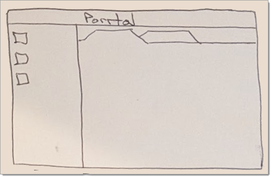
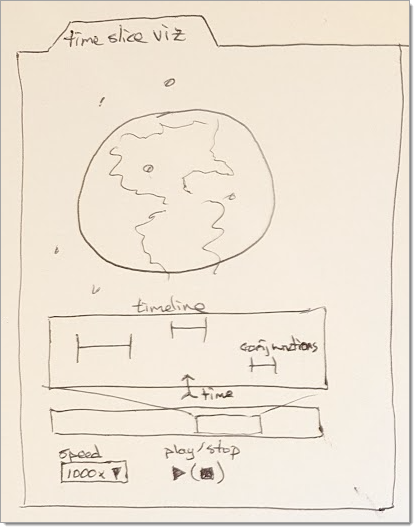
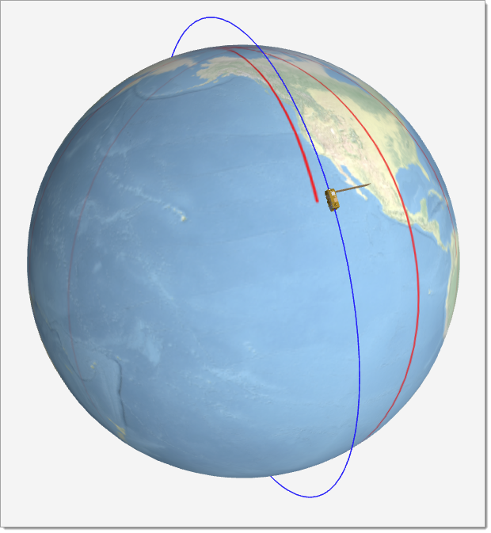
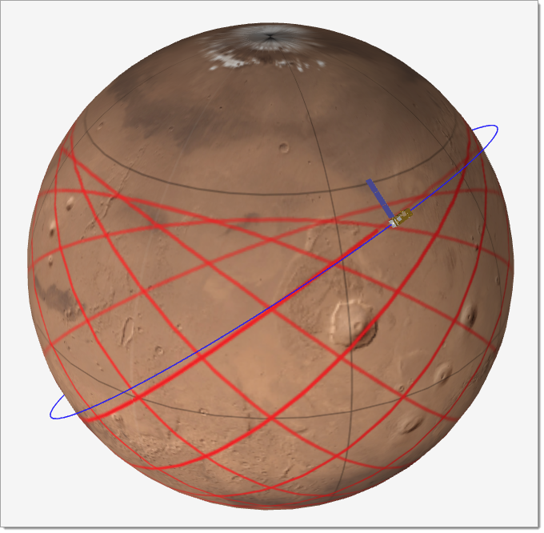

# @orbital-eye/e02-visualize Sample

The open-source [Porrtal](https://github.com/comcast/porrtal) project provides a platform for easily creating an IDE-like user experience for your React application.

React components are independent and reusable bits of code that typically occupy a rectangular area of the UI.

When building a Porrtal app, you will define an array of Porrtal "Views". Each Porrtal View object in the array references one of your React components. The View object also includes properties like icon, display text, pane, and more. The View object helps Porrtal load your components into the Porrtal app.

The `nav` and `main` panes are shown in the image below.



- [@orbital-eye/e02-visualize Sample](#orbital-eyee02-visualize-sample)
- [Entity Types](#entity-types)
  - [**Satellite** - The "Satellite" entity type represents each tracked Earth-orbiting item in the array](#satellite---the-satellite-entity-type-represents-each-tracked-earth-orbiting-item-in-the-array)
  - [**Conjunction** - An event where pair of Satellites that pass within the defined threshold distance of eachother](#conjunction---an-event-where-pair-of-satellites-that-pass-within-the-defined-threshold-distance-of-eachother)
- [Data Management](#data-management)
  - [**1. Satellite Data**](#1-satellite-data)
    - [**Atom Definition**](#atom-definition)
    - [**Explanation**](#explanation)
    - [**Usage Example**](#usage-example)
  - [**2. Conjunction Forecast**](#2-conjunction-forecast)
    - [Atom Definition:](#atom-definition-1)
    - [Usage:](#usage)
  - [**3. Satellite Locations for a Particular Time**](#3-satellite-locations-for-a-particular-time)
    - [Atom Family for Multiple Views:](#atom-family-for-multiple-views)
    - [Usage:](#usage-1)
  - [**Jotai Integration**](#jotai-integration)
  - [**Example Component Usage**](#example-component-usage)
    - [Display Satellite Data:](#display-satellite-data)
    - [Display Conjunction Warnings:](#display-conjunction-warnings)
    - [Manage Satellite Locations Per View:](#manage-satellite-locations-per-view)
- [Views](#views)
  - [project-info](#project-info)
  - [time-slice-viz](#time-slice-viz)
  - [conjunction-list](#conjunction-list)
  - [conjunction-details](#conjunction-details)
  - [satellite-search](#satellite-search)
  - [satellite-details](#satellite-details)
  - [conjunction-details](#conjunction-details-1)
  - [earth-satellite](#earth-satellite)
  - [mars-satellite](#mars-satellite)
- [Web Workers](#web-workers)
  - [compute-positions-worker](#compute-positions-worker)
    - [**Approach**](#approach)
      - [**1. Data Management**](#1-data-management)
      - [**2. Web Worker**](#2-web-worker)
      - [**3. Timeline Control**](#3-timeline-control)
      - [**4. Visualization**](#4-visualization)
    - [**Implementation**](#implementation)
      - [**Web Worker (compute-position-worker.ts)**](#web-worker-compute-position-workerts)
      - [**Main Thread Integration**](#main-thread-integration)
      - [**Visualization Update**](#visualization-update)
    - [**Benefits of This Approach**](#benefits-of-this-approach)
  - [conjunction-forecast-worker](#conjunction-forecast-worker)
    - [**Web Worker Code: `conjunction-forecast-worker.ts`**](#web-worker-code-conjunction-forecast-workerts)
    - [**Main Thread Integration with Progress**](#main-thread-integration-with-progress)
    - [**UI for Progress**](#ui-for-progress)
    - [**Key Updates**](#key-updates)
- [Recipe](#recipe)
  - [Create Library](#create-library)
  - [Create View Components](#create-view-components)
  - [Add Page to orbital-eye App](#add-page-to-orbital-eye-app)
  - [Add Porrtal Wrapper Component e02-porrtal-wrapper](#add-porrtal-wrapper-component-e02-porrtal-wrapper)
- [Miscelaneous Links](#miscelaneous-links)
  - [ObservableHQ Framework](#observablehq-framework)
  - [d3js satellite tracker - earth](#d3js-satellite-tracker---earth)
  - [d3js satellite tracker - mars](#d3js-satellite-tracker---mars)
  - [d3js satellite view of earth](#d3js-satellite-view-of-earth)
  - [d3js intro](#d3js-intro)
- [Space Track Earth-Orbiting Data Download](#space-track-earth-orbiting-data-download)
  - [**Field Descriptions**](#field-descriptions)
  - [**Key Points**](#key-points)
- [Nx Monorepo Tool](#nx-monorepo-tool)
  - [Running unit tests](#running-unit-tests)

# Entity Types

## **Satellite** - The "Satellite" entity type represents each tracked Earth-orbiting item in the array
## **Conjunction** - An event where pair of Satellites that pass within the defined threshold distance of eachother

# Data Management

To manage application data, the orbital-eye application will utilize [Jotai](https://jotai.org/), leveraging atoms to track different collections of data. Here's how Jotai will be used for each of the application data requirements:

## **1. Satellite Data**
This collection represents the static data about satellites, such as metadata and TLEs. It is shared across the application and does not change frequently.

### **Atom Definition**

```typescript
import { atom } from "jotai";

export interface SatelliteData {
  CCSDS_OMM_VERS: string;         // Version of the CCSDS OMM standard
  COMMENT: string;               // Descriptive comment about the data set
  CREATION_DATE?: Date;          // Date and time the record was created (optional)
  ORIGINATOR: string;            // Entity responsible for generating the data
  OBJECT_NAME?: string;          // Common name of the satellite (optional)
  OBJECT_ID?: string;            // Unique identifier for the satellite (optional)
  CENTER_NAME: string;           // Name of the celestial center, typically 'EARTH'
  REF_FRAME: string;             // Reference frame, typically 'TEME'
  TIME_SYSTEM: string;           // Time system used, typically 'UTC'
  MEAN_ELEMENT_THEORY: string;   // Theory used for mean orbital elements, typically 'SGP4'
  EPOCH?: Date;                  // Epoch of the orbital elements (optional)
  MEAN_MOTION?: number;          // Mean motion (revolutions per day) (optional)
  ECCENTRICITY?: number;         // Orbital eccentricity (optional)
  INCLINATION?: number;          // Orbital inclination (degrees) (optional)
  RA_OF_ASC_NODE?: number;       // Right ascension of the ascending node (degrees) (optional)
  ARG_OF_PERICENTER?: number;    // Argument of perigee (degrees) (optional)
  MEAN_ANOMALY?: number;         // Mean anomaly (degrees) (optional)
  EPHEMERIS_TYPE?: number;       // Ephemeris type indicator (optional)
  CLASSIFICATION_TYPE?: string;  // Classification type ('U' for unclassified) (optional)
  NORAD_CAT_ID: number;          // NORAD catalog ID
  ELEMENT_SET_NO?: number;       // Element set number (optional)
  REV_AT_EPOCH?: number;         // Revolution number at epoch (optional)
  BSTAR?: number;                // BSTAR drag term (optional)
  MEAN_MOTION_DOT?: number;      // First derivative of mean motion (optional)
  MEAN_MOTION_DDOT?: number;     // Second derivative of mean motion (optional)
  SEMIMAJOR_AXIS?: number;       // Semi-major axis (km) (optional)
  PERIOD?: number;               // Orbital period (minutes) (optional)
  APOAPSIS?: number;             // Apogee altitude (km) (optional)
  PERIAPSIS?: number;            // Perigee altitude (km) (optional)
  OBJECT_TYPE?: string;          // Type of object (e.g., 'PAYLOAD', 'ROCKET BODY') (optional)
  RCS_SIZE?: string;             // Radar cross-section size ('SMALL', 'MEDIUM', 'LARGE') (optional)
  COUNTRY_CODE?: string;         // Country code of ownership (optional)
  LAUNCH_DATE?: Date;            // Launch date of the object (optional)
  SITE?: string;                 // Launch site (optional)
  DECAY_DATE?: Date;             // Decay date (if applicable) (optional)
  FILE?: number;                 // File identifier (optional)
  GP_ID: number;                 // Unique identifier for the GP record
  TLE_LINE0?: string;            // TLE line 0 (name of the satellite) (optional)
  TLE_LINE1?: string;            // TLE line 1 containing orbital elements (optional)
  TLE_LINE2?: string;            // TLE line 2 containing orbital elements (optional)
}

export const satelliteDataAtom = atom<SatelliteData[]>([]);
```

### **Explanation**
1. **Optional Fields**:
   - Fields like `EPOCH`, `MEAN_MOTION`, and `OBJECT_TYPE` are marked as optional (`?`) because they may not always have a value.

2. **Typed Fields**:
   - Fields like `NORAD_CAT_ID`, `GP_ID`, and `MEAN_MOTION` are strongly typed as `number`, `string`, or `Date` based on the satellite data structure.

3. **Array of Objects**:
   - The atom holds an array of `SatelliteData` objects, representing the collection of satellites in the application.

### **Usage Example**

To populate this atom with fetched data:

```typescript
import { useSetAtom } from "jotai";
import { satelliteDataAtom } from "./state";

const loadSatelliteData = async () => {
  const setSatelliteData = useSetAtom(satelliteDataAtom);

  const response = await fetch("path_to_satellite_data.json");
  const data = await response.json();

  setSatelliteData(data);
};
```

This atom will track all satellite data, making it accessible across the application. 🚀

---

## **2. Conjunction Forecast**
This collection tracks forecasted conjunction warnings, including satellite pairs, start and end times, and distances. It is calculated asynchronously and updated as new forecasts are computed.

### Atom Definition:
```typescript
interface ConjunctionWarning {
  satellite1: string;
  satellite2: string;
  startTime: Date;
  endTime: Date;
  minDistance: number;
}

export const conjunctionForecastAtom = atom<ConjunctionWarning[]>([]);
```

### Usage:
- Populate this atom by running the conjunction forecast in a Web Worker and updating it with the results.
- Components can subscribe to this atom to display conjunction warnings in the UI, such as in a timeline or detailed view.

---

## **3. Satellite Locations for a Particular Time**
This collection tracks dynamic data representing satellite positions for a specific time. Since the app allows multiple independent views of timelines, each view needs its own set of satellite positions.

### Atom Family for Multiple Views:
Jotai's `atomFamily` allows for dynamically created atoms based on unique keys.  The `viewStateKey` uniquely identifies the instance of the View in Porrtal.

```typescript
import { atomFamily } from "jotai/utils";

interface SatelliteSnapshot {
    startTime: Date;
    currentTime: Date;
    endTime: Date;
    playBackSpeedMultiplier: number;
    playMode: boolean;
    selectedSatellite: string;
    viewStateKey: string;
    SatellitePosition[];
}

interface SatellitePosition {
  OBJECT_NAME: string;
  position: { x: number; y: number; z: number };
}

export const satelliteLocationsAtomFamily = atomFamily<string, SatelliteSnapshot>((viewId) => atom([]));
```

### Usage:
- For each view, create a unique atom by passing the `viewId`:
  ```typescript
  const view1Locations = satelliteLocationsAtomFamily("view1");
  const view2Locations = satelliteLocationsAtomFamily("view2");
  ```
- Populate these atoms with the satellite positions calculated for the current time in the respective timeline view.
- Components tied to a specific view will subscribe to their corresponding atom.

---

## **Jotai Integration**

1. **Global State Management**:
   - The `satelliteDataAtom` and `conjunctionForecastAtom` are global, shared across all components, and provide foundational data for satellite visualizations and analysis.

2. **Per-View State Management**:
   - The `satelliteLocationsAtomFamily` enables each timeline view to independently track and manage satellite positions for its specific time.

3. **Reactivity**:
   - When atoms are updated (e.g., positions are recalculated or a new forecast is generated), all components subscribed to those atoms automatically re-render with the new data.

4. **Computation Integration**:
   - Use derived atoms or utilities like `useEffect` to update atoms based on calculations or external events, such as advancing a timeline or fetching new forecast data.

---

## **Example Component Usage**

### Display Satellite Data:
```tsx
import { useAtom } from "jotai";
import { satelliteDataAtom } from "./state";

const SatelliteList = () => {
  const [satellites] = useAtom(satelliteDataAtom);

  return (
    <ul>
      {satellites.map((sat) => (
        <li key={sat.OBJECT_NAME}>{sat.OBJECT_NAME}</li>
      ))}
    </ul>
  );
};
```

### Display Conjunction Warnings:
```tsx
import { useAtom } from "jotai";
import { conjunctionForecastAtom } from "./state";

const ConjunctionWarnings = () => {
  const [conjunctions] = useAtom(conjunctionForecastAtom);

  return (
    <ul>
      {conjunctions.map((c, index) => (
        <li key={index}>
          {c.satellite1} and {c.satellite2} at {c.startTime.toISOString()} - {c.endTime.toISOString()} (Min Distance: {c.minDistance} km)
        </li>
      ))}
    </ul>
  );
};
```

### Manage Satellite Locations Per View:
```tsx
import { useAtom } from "jotai";
import { satelliteLocationsAtomFamily } from "./state";

const SatelliteTimelineView = ({ viewId }: { viewId: string }) => {
  const [locations] = useAtom(satelliteLocationsAtomFamily(viewId));

  return (
    <ul>
      {locations.map((loc) => (
        <li key={loc.OBJECT_NAME}>
          {loc.OBJECT_NAME}: x={loc.position.x}, y={loc.position.y}, z={loc.position.z}
        </li>
      ))}
    </ul>
  );
};
```

This structure ensures a clean separation of concerns while leveraging Jotai's simplicity and performance for managing state across the application. 🚀

---

# Views

## project-info

The project-info View displays information about the project and will be loaded in tab in the main pane when the orbital-eye app is launched.

## time-slice-viz

The time-slice-viz View provides a visualization of satellite positions around the Earth at a given point in time.  A timeline control allows the user to jump to a specific time to update the satellite locations.  Alternatively, the user can put the timeline in play mode which will roll forward in time (updating the satellite locations) at the specified time accelleration parameter.  The user can specify the desired start and stop time for the timeline.  The timeline also displays conjunction data where appropriate.



## conjunction-list

The conjunction-list View provides an interface that can be used to calculate conjunction warnings for the specified time range.  Once calculated, the conjunctions are listed in a paging style interface.  The user can filter the list using a search string, if desired.

## conjunction-details

The conjunction-details View provides an interface that can be used to investige and visualize a conjunction event.

## satellite-search

The satellite-search View allows the user to type in a string and see a list of the satellite records that contain that string.

## satellite-details

When a satellite is selected in one of the time-slice-viz Views or the conjunction-list View, the satellite-details View is displayed in the `nav` pane.  The existing satellite-detials View will be replaced when the next satellite is selected, unless the user choose to "pin" the satellite-detials view, in which case, an additional satellite-details View will be launched in the `nav` pane.

## conjunction-details

When a conjunction is selected in the conjunction-list View, the conjunction-details View is displayed in the `nav` pane.  The existing conjunction-detials View will be replaced when the next conjunction is selected, unless the user choose to "pin" the conjunction-detials view, in which case, an additional conjunction-details View will be launched in the `nav` pane.

## earth-satellite

A menu is provided to launch the [Earth Ground Track Visualizer](https://observablehq.com/@jake-low/satellite-ground-track-visualizer) in a Porrtal tab in the `main` pane.



## mars-satellite

A menu is provided to launch the [Mars Ground Track Visualizer](https://observablehq.com/@mammoth80/satellite-ground-track-visualizer) in a Porrtal tab in the `main` pane.



---

# Web Workers

## compute-positions-worker

The strategy for calculating satellite positions and conjunctions is to run the calculations only for a single time slice (and iterate as needed).  This makes the proof of concept more efficient than trying to store all of the data points over three days.  The following describes how the system is structured:

### **Approach**

#### **1. Data Management**
- **Satellite Data**:
  - Store the TLE data and other metadata for all satellites in memory (e.g., an array of objects) using jotai.
  - Use this data for position calculations at the current time.
  
- **Current Time Data**:
  - Store positions only for the current time in memory using jotai:
    ```typescript
    const currentPositions: Record<string, { x: number; y: number; z: number }> = {};
    ```
  
- **Conjunction Data**:
  - Maintain a lightweight list of conjunction events with metadata for the timeline stored in jotai:
    ```typescript
    const conjunctions: Array<{ time: Date; satellite1: string; satellite2: string; distance: number }> = [];
    ```

#### **2. Web Worker**
- Use a Web Worker to calculate positions and conjunctions for a given time step:
  - Receive the TLE data and the current timestamp.
  - Calculate positions for all satellites.
  - Check for conjunctions by computing pairwise distances and flagging those below a threshold (e.g., 10 km).
  - Return the calculated positions and conjunctions to the main thread.

#### **3. Timeline Control**
- Provide a timeline selector and playback controls in the UI:
  - Allow the user to select a specific time or start an automatic playback at a chosen rate (e.g., 10 seconds per real-time second).
  - On each time change, trigger the Web Worker to calculate positions and update the view.

#### **4. Visualization**
- Use **@react-three/fiber** with **Three.js** to render satellite positions dynamically.
- Highlight conjunctions visually (e.g., connect satellites involved in a conjunction with lines or highlight them in red).

---

### **Implementation**

#### **Web Worker (compute-position-worker.ts)**

```typescript
import * as satellite from "satellite.js";

self.onmessage = (event) => {
  const { tles, timestamp } = event.data;

  const positions = {};
  const conjunctions = [];

  for (let i = 0; i < tles.length; i++) {
    const sat1 = tles[i];
    const satrec1 = satellite.twoline2satrec(sat1.TLE_LINE1, sat1.TLE_LINE2);

    const positionAndVelocity1 = satellite.propagate(satrec1, new Date(timestamp));
    if (!positionAndVelocity1.position) continue;

    const gmst = satellite.gstime(new Date(timestamp));
    const positionEci1 = positionAndVelocity1.position;

    // Store position for sat1
    positions[sat1.OBJECT_NAME] = satellite.eciToGeodetic(positionEci1, gmst);

    // Check for conjunctions with other satellites
    for (let j = i + 1; j < tles.length; j++) {
      const sat2 = tles[j];
      const satrec2 = satellite.twoline2satrec(sat2.TLE_LINE1, sat2.TLE_LINE2);

      const positionAndVelocity2 = satellite.propagate(satrec2, new Date(timestamp));
      if (!positionAndVelocity2.position) continue;

      const positionEci2 = positionAndVelocity2.position;
      const distance = Math.sqrt(
        Math.pow(positionEci1.x - positionEci2.x, 2) +
        Math.pow(positionEci1.y - positionEci2.y, 2) +
        Math.pow(positionEci1.z - positionEci2.z, 2)
      );

      if (distance < 10) { // Conjunction threshold in km
        conjunctions.push({
          time: timestamp,
          satellite1: sat1.OBJECT_NAME,
          satellite2: sat2.OBJECT_NAME,
          distance,
        });
      }
    }
  }

  self.postMessage({ positions, conjunctions });
};
```

---

#### **Main Thread Integration**

```typescript
const worker = new Worker(new URL('./compute-position-worker.ts', import.meta.url));
let currentTime = new Date();

worker.onmessage = (event) => {
  const { positions, conjunctions } = event.data;

  // Update the visualization
  updateVisualization(positions);

  // Store and display conjunctions
  updateConjunctions(conjunctions);
};

const updateTime = () => {
  currentTime = new Date(currentTime.getTime() + 10 * 1000); // Advance by 10 seconds
  worker.postMessage({ tles, timestamp: currentTime });
};

// Start timeline playback
setInterval(updateTime, 1000); // Update every real-time second
```

---

#### **Visualization Update**

```tsx
import { Canvas } from "@react-three/fiber";

const SatelliteVisualization = ({ positions, conjunctions }) => {
  return (
    <Canvas>
      {/* Render satellites */}
      {Object.entries(positions).map(([name, pos]) => (
        <mesh key={name} position={[pos.x, pos.y, pos.z]}>
          <sphereGeometry args={[0.1, 32, 32]} />
          <meshStandardMaterial color="white" />
        </mesh>
      ))}

      {/* Highlight conjunctions */}
      {conjunctions.map((conjunction, index) => (
        <line key={index}>
          <bufferGeometry>
            <bufferAttribute
              attach="attributes-position"
              array={new Float32Array([
                positions[conjunction.satellite1].x,
                positions[conjunction.satellite1].y,
                positions[conjunction.satellite1].z,
                positions[conjunction.satellite2].x,
                positions[conjunction.satellite2].y,
                positions[conjunction.satellite2].z,
              ])}
              count={2}
              itemSize={3}
            />
          </bufferGeometry>
          <lineBasicMaterial color="red" />
        </line>
      ))}
    </Canvas>
  );
};
```

---

### **Benefits of This Approach**
1. **Memory Efficiency**: Only stores data for the current time step.
2. **Scalability**: Web Worker handles heavy computations without blocking the UI.
3. **Interactivity**: Timeline selector allows users to explore and visualize data dynamically.
4. **Focused Storage**: Only conjunctions are stored, which is a small dataset compared to satellite positions.

## conjunction-forecast-worker

To provide progress updates while processing the conjunction forecast, the **Web Worker** can periodically send progress messages to the main thread. These messages can include the percentage of completion based on the time range being processed.

### **Web Worker Code: `conjunction-forecast-worker.ts`**

```typescript
import * as satellite from "satellite.js";

interface TLEData {
  OBJECT_NAME: string;
  TLE_LINE1: string;
  TLE_LINE2: string;
}

interface ConjunctionWarning {
  satellite1: string;
  satellite2: string;
  startTime: Date;
  endTime: Date;
  minDistance: number;
}

self.onmessage = (event) => {
  const { tles, startTime, endTime, intervalSeconds, threshold } = event.data;

  const conjunctionWarnings: ConjunctionWarning[] = [];
  const activeConjunctions: Map<string, { startTime: Date; minDistance: number }> = new Map();

  const totalSteps = Math.ceil((new Date(endTime).getTime() - new Date(startTime).getTime()) / (intervalSeconds * 1000));
  let currentStep = 0;

  let currentTime = new Date(startTime);

  while (currentTime <= new Date(endTime)) {
    const positions: Record<string, { x: number; y: number; z: number }> = {};

    // Calculate satellite positions for the current time
    tles.forEach((sat) => {
      const satrec = satellite.twoline2satrec(sat.TLE_LINE1, sat.TLE_LINE2);
      const propagation = satellite.propagate(satrec, currentTime);

      if (propagation.position) {
        const gmst = satellite.gstime(currentTime);
        const positionEci = propagation.position;
        const { x, y, z } = satellite.eciToGeodetic(positionEci, gmst);
        positions[sat.OBJECT_NAME] = { x, y, z };
      }
    });

    // Check for conjunctions between all pairs of satellites
    tles.forEach((sat1, i) => {
      for (let j = i + 1; j < tles.length; j++) {
        const sat2 = tles[j];
        const pos1 = positions[sat1.OBJECT_NAME];
        const pos2 = positions[sat2.OBJECT_NAME];

        if (pos1 && pos2) {
          const distance = Math.sqrt(
            Math.pow(pos1.x - pos2.x, 2) +
              Math.pow(pos1.y - pos2.y, 2) +
              Math.pow(pos1.z - pos2.z, 2)
          );

          const key = `${sat1.OBJECT_NAME}-${sat2.OBJECT_NAME}`;

          if (distance < threshold) {
            // If already in a conjunction, update the minimum distance
            if (activeConjunctions.has(key)) {
              const active = activeConjunctions.get(key)!;
              active.minDistance = Math.min(active.minDistance, distance);
            } else {
              // Start a new conjunction
              activeConjunctions.set(key, { startTime: new Date(currentTime), minDistance: distance });
            }
          } else if (activeConjunctions.has(key)) {
            // End the conjunction
            const active = activeConjunctions.get(key)!;
            conjunctionWarnings.push({
              satellite1: sat1.OBJECT_NAME,
              satellite2: sat2.OBJECT_NAME,
              startTime: active.startTime,
              endTime: new Date(currentTime),
              minDistance: active.minDistance,
            });
            activeConjunctions.delete(key);
          }
        }
      }
    });

    // Increment time and update progress
    currentStep++;
    const progress = (currentStep / totalSteps) * 100;
    self.postMessage({ type: "progress", progress });

    currentTime = new Date(currentTime.getTime() + intervalSeconds * 1000);
  }

  // Handle any ongoing conjunctions that didn't end within the time range
  activeConjunctions.forEach((active, key) => {
    const [satellite1, satellite2] = key.split("-");
    conjunctionWarnings.push({
      satellite1,
      satellite2,
      startTime: active.startTime,
      endTime: new Date(endTime),
      minDistance: active.minDistance,
    });
  });

  // Send final results
  self.postMessage({ type: "complete", conjunctionWarnings });
};
```

---

### **Main Thread Integration with Progress**

Here’s how to use the worker to display progress:

```typescript
const forecastWorker = new Worker(new URL('./conjunction-forecast-worker.ts', import.meta.url));
let progress = 0;

forecastWorker.onmessage = (event) => {
  const { type, progress: currentProgress, conjunctionWarnings } = event.data;

  if (type === "progress") {
    progress = currentProgress;
    updateProgressUI(progress); // Update the UI with the current progress
  } else if (type === "complete") {
    console.log("Conjunction Warnings:", conjunctionWarnings);
    updateConjunctionWarnings(conjunctionWarnings); // Display the final results in the UI
  }
};

const forecastStartTime = new Date("2025-01-01T00:00:00Z");
const forecastEndTime = new Date("2025-01-04T00:00:00Z");
const timeInterval = 10; // Seconds
const conjunctionThreshold = 10; // Kilometers

forecastWorker.postMessage({
  tles, // Array of TLEData
  startTime: forecastStartTime,
  endTime: forecastEndTime,
  intervalSeconds: timeInterval,
  threshold: conjunctionThreshold,
});

// Function to update the progress UI
function updateProgressUI(progress: number) {
  const progressBar = document.getElementById("progress-bar")!;
  progressBar.style.width = `${progress}%`;
  progressBar.innerText = `${Math.round(progress)}%`;
}
```

---

### **UI for Progress**

Add a simple progress bar to your HTML:

```html
<div id="progress-container" style="width: 100%; border: 1px solid #ccc;">
  <div id="progress-bar" style="width: 0%; height: 20px; background: #4caf50; color: white; text-align: center;">
    0%
  </div>
</div>
```

---

### **Key Updates**
1. **Progress Messages**:
   - The Web Worker sends periodic progress updates (`type: "progress"`) as it processes each time step.

2. **Complete Message**:
   - At the end, the worker sends a `type: "complete"` message containing the final conjunction warnings.

3. **UI Feedback**:
   - The progress bar visually reflects the worker's progress in real-time, keeping the user informed.

This approach ensures a responsive UI while processing the conjunction forecast and enhances the user experience by providing clear feedback on the computation's progress. 🚀

---

# Recipe

## Create Library

```bash
nx g @nx/react:library --name=orbital-eye-e01-visualize --bundler=rollup --directory=libs/orbital-eye/e01-visualize --component=false --importPath=@orbital-eye/e01-visualize --projectNameAndRootFormat=as-provided --publishable=true --style=scss --unitTestRunner=jest
```

## Create View Components

```bash
# project-info
nx g @nx/react:component --path=libs/orbital-eye/e02-visualize/project-info/project-info --export=true --style=scss

# time-slice-viz
nx g @nx/react:component --path=libs/orbital-eye/e02-visualize/time-slice-viz/time-slice-viz --export=true --style=scss

# conjunction-list
nx g @nx/react:component --path=libs/orbital-eye/e02-visualize/conjunction-list/conjunction-list --export=true --style=scss

# conjunction-details
nx g @nx/react:component --path=libs/orbital-eye/e02-visualize/conjunction-details/conjunction-details --export=true --style=scss

# satellite-search
nx g @nx/react:component --path=libs/orbital-eye/e02-visualize/satellite-search/satellite-search --export=true --style=scss

# satellite-details
nx g @nx/react:component --path=libs/orbital-eye/e02-visualize/satellite-details/satellite-details --export=true --style=scss

# i-frame-host
nx g @nx/react:component --path=libs/orbital-eye/e02-visualize/i-frame-host/i-frame-host --export=true --style=scss
```

## Add Page to orbital-eye App

```bash
nx g @nx/next:page --path=apps/orbital-eye/pages/e02 --style=scss
```

## Add Porrtal Wrapper Component e02-porrtal-wrapper

```bash
nx g @nx/react:component --path=apps/orbital-eye/components/e02-porrtal-wrapper/e02-porrtal-wrapper --export=false --style=scss
```

---

# Miscelaneous Links

## ObservableHQ Framework

1. Create `orbital-eye-observable-01` repo for static site generator
2. Create `Pages`
3. Build to Create the `dist` folder
4. Copy `dist` contents to `public/observable-01` in orbital-eye app in orbital-eye repo
5. Create IFrameHost View
6. Register IFrameHost Views for Each `Page` (Define Menu Items to Launch Views)


* [Static Site Generator](https://observablehq.com/blog/what-is-static-site-generator)
* [Observable Framework - Mike Bostock](https://observablehq.com/blog/observable-2-0)
* [Observable Framework - Overview](https://observablehq.com/framework/)
* [Observable Framework - What is it](https://observablehq.com/framework/what-is-framework)
* [Observable Framework - Getting Started](https://observablehq.com/framework/getting-started)
* [Observable Framework - Deploying](https://observablehq.com/framework/deploying)
* [Observable Framework - Embedding](https://observablehq.com/framework/embeds)

```bash
npx "@observablehq/framework@latest" create
npm run dev -- --port 4321
npm run build
npx http-server dist
npm update
```

## d3js satellite tracker - earth
* https://observablehq.com/@jake-low/satellite-ground-track-visualizer


## d3js satellite tracker - mars
* https://observablehq.com/@mammoth80/satellite-ground-track-visualizer


## d3js satellite view of earth
* https://observablehq.com/@d3/satellite
* https://observablehq.com/@d3/satellite-explorer

## d3js intro
* https://observablehq.com/@mitvis/introduction-to-d3

# Space Track Earth-Orbiting Data Download

The [general perturbations (GP)](https://www.space-track.org/documentation#api-basicSpaceDataGp) class is an efficient listing of the newest SGP4 keplerian element set for each man-made earth-orbiting object tracked by the 18th Space Defense Squadron. It is designed to accommodate the expanded satellite catalog’s 9-digit identifiers. Users can return data in the CCSDS flexible Orbit Mean-Elements Message (OMM) format in canonical XML/KVN, JSON, CSV, or HTML. All 5 of these formats use the same keywords and definitions for OMM as provided in the Orbit Data Messages (ODM) [CCSDS Recommended Standard 502.0-B-3](https://public.ccsds.org/Pubs/502x0b3e1.pdf)

Select catalog numbers below 100,000 are also available in the legacy fixed-width TLE or 3LE format. While the [Alpha-5](https://www.space-track.org/documentation#/tle-alpha5) schema extends the range that the TLE format supports to include numbers up to 339,999, https://Space-Track.org and https://Celestrak.com recommend that developers migrate their software to use the OMM standard for all GP ephemerides. Please see the [Alpha-5 documentation](https://www.space-track.org/documentation#/tle-alpha5) for more on this.

Note: Alpha-5 formatted ELSETs will only be available through the TLE and 3LE formats of the gp and gp_history class.

This class also allows for expanded elset filtering based on additional object metadata from the satellite catalog like:
radar cross section (RCS_SIZE): Small, Medium, Large
object type (OBJECT_TYPE): Payload, Rocket Body, Debris, Unknown
launch site (SITE)
launch date (LAUNCH_DATE)
decay date (DECAY_DATE)
country code (COUNTRY_CODE)
file identifier for groups uploaded together (FILE)
unique ephemerides identifier (GP_ID)
... if such values exist for the object. Note that many analyst satellite objects' catalog numbers above 70,000 do not have much metadata.

Please see all available columns for filtering by viewing the [gp class's model definition](https://www.space-track.org/basicspacedata/modeldef/class/gp/format/html).

Note: Queries made in HTML, JSON, and CSV will contain the TLE lines as fields (TLE_LINE0, TLE_LINE1, TLE_LINE2). The OMM (XML/KVN) formats do not contain these fields in order to save space and eliminate redundancy.

The recommended URL for retrieving the newest propagable element set for all on-orbit objects is:
https://www.space-track.org/basicspacedata/query/class/gp/decay_date/null-val/epoch/%3Enow-30/orderby/norad_cat_id/format/json

Each entry in the dataset stores detailed orbital and metadata information for satellites, conforming to the CCSDS OMM standard.

---

## **Field Descriptions**

| Field                   | Type                    | Null | Key  | Default | Extra         | Description                                                              |
|-------------------------|-------------------------|------|------|---------|---------------|--------------------------------------------------------------------------|
| **CCSDS_OMM_VERS**      | `varchar(3)`           | NO   |      |         |               | Version of the CCSDS OMM standard.                                      |
| **COMMENT**             | `varchar(33)`          | NO   |      |         |               | Descriptive comment about the data set.                                 |
| **CREATION_DATE**       | `datetime`             | YES  |      |         |               | Date and time the record was created.                                   |
| **ORIGINATOR**          | `varchar(7)`           | NO   |      |         |               | Entity responsible for generating the data.                             |
| **OBJECT_NAME**         | `varchar(25)`          | YES  |      |         |               | Common name of the satellite.                                           |
| **OBJECT_ID**           | `varchar(12)`          | YES  |      |         |               | Unique identifier for the satellite.                                    |
| **CENTER_NAME**         | `varchar(5)`           | NO   |      |         |               | Name of the celestial center, typically `EARTH`.                        |
| **REF_FRAME**           | `varchar(4)`           | NO   |      |         |               | Reference frame, typically `TEME`.                                      |
| **TIME_SYSTEM**         | `varchar(3)`           | NO   |      |         |               | Time system used, typically `UTC`.                                      |
| **MEAN_ELEMENT_THEORY** | `varchar(4)`           | NO   |      |         |               | Theory used for mean orbital elements, typically `SGP4`.                |
| **EPOCH**               | `datetime(6)`          | YES  |      |         |               | Epoch of the orbital elements.                                          |
| **MEAN_MOTION**         | `decimal(13,8)`        | YES  |      |         |               | Mean motion (revolutions per day).                                      |
| **ECCENTRICITY**        | `decimal(13,8)`        | YES  |      |         |               | Orbital eccentricity.                                                   |
| **INCLINATION**         | `decimal(7,4)`         | YES  |      |         |               | Orbital inclination (degrees).                                          |
| **RA_OF_ASC_NODE**      | `decimal(7,4)`         | YES  |      |         |               | Right ascension of the ascending node (degrees).                        |
| **ARG_OF_PERICENTER**   | `decimal(7,4)`         | YES  |      |         |               | Argument of perigee (degrees).                                          |
| **MEAN_ANOMALY**        | `decimal(7,4)`         | YES  |      |         |               | Mean anomaly (degrees).                                                 |
| **EPHEMERIS_TYPE**      | `tinyint(4)`           | YES  |      | `0`     |               | Ephemeris type indicator.                                               |
| **CLASSIFICATION_TYPE** | `char(1)`              | YES  |      |         |               | Classification type (`U` for unclassified).                             |
| **NORAD_CAT_ID**        | `int(10) unsigned`     | NO   |      |         |               | NORAD catalog ID.                                                       |
| **ELEMENT_SET_NO**      | `smallint(5) unsigned` | YES  |      |         |               | Element set number.                                                     |
| **REV_AT_EPOCH**        | `mediumint(8) unsigned`| YES  |      |         |               | Revolution number at epoch.                                             |
| **BSTAR**               | `decimal(19,14)`       | YES  |      |         |               | BSTAR drag term.                                                        |
| **MEAN_MOTION_DOT**     | `decimal(9,8)`         | YES  |      |         |               | First derivative of mean motion.                                        |
| **MEAN_MOTION_DDOT**    | `decimal(22,13)`       | YES  |      |         |               | Second derivative of mean motion.                                       |
| **SEMIMAJOR_AXIS**      | `double(12,3)`         | YES  |      |         |               | Semi-major axis (km).                                                   |
| **PERIOD**              | `double(12,3)`         | YES  |      |         |               | Orbital period (minutes).                                               |
| **APOAPSIS**            | `double(12,3)`         | YES  |      |         |               | Apogee altitude (km).                                                   |
| **PERIAPSIS**           | `double(12,3)`         | YES  |      |         |               | Perigee altitude (km).                                                  |
| **OBJECT_TYPE**         | `varchar(12)`          | YES  |      |         |               | Type of object (e.g., `PAYLOAD`, `ROCKET BODY`).                        |
| **RCS_SIZE**            | `char(6)`              | YES  |      |         |               | Radar cross-section size (`SMALL`, `MEDIUM`, `LARGE`).                  |
| **COUNTRY_CODE**        | `char(6)`              | YES  |      |         |               | Country code of ownership.                                              |
| **LAUNCH_DATE**         | `date`                | YES  |      |         |               | Launch date of the object.                                              |
| **SITE**                | `char(5)`              | YES  |      |         |               | Launch site.                                                            |
| **DECAY_DATE**          | `date`                | YES  |      |         |               | Decay date (if applicable).                                             |
| **FILE**                | `bigint(20) unsigned`  | YES  |      |         |               | File identifier.                                                        |
| **GP_ID**               | `int(10) unsigned`    | NO   |      |         |               | Unique identifier for the GP record.                                    |
| **TLE_LINE0**           | `varchar(27)`          | YES  |      |         |               | TLE line 0 (name of the satellite).                                     |
| **TLE_LINE1**           | `varchar(71)`          | YES  |      |         |               | TLE line 1 containing orbital elements.                                 |
| **TLE_LINE2**           | `varchar(71)`          | YES  |      |         |               | TLE line 2 containing orbital elements.                                 |

## **Key Points**
- The table supports CCSDS OMM standard for orbital metadata.
- TLE data (line 0, 1, and 2) is stored for compatibility with SGP4 propagation models.
- Fields like `NORAD_CAT_ID`, `OBJECT_NAME`, and `GP_ID` are critical for uniquely identifying satellites.
- Orbital parameters (e.g., `ECCENTRICITY`, `INCLINATION`) support accurate orbital calculations.

---

# Nx Monorepo Tool

This library was generated with [Nx](https://nx.dev).

## Running unit tests

Run `nx test orbital-eye-e02-visualize` to execute the unit tests via [Jest](https://jestjs.io).
